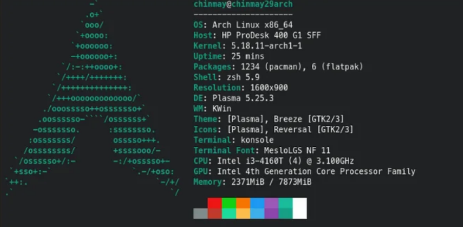

# 🖥️ Better Windows Terminal (Linux-style)

> Minimal setup to make your Windows Terminal look and feel like a Linux environment using PowerShell + fastfetch.

---

## 📸 Preview



---

## 🚀 Features

* Arch/Linux-style terminal look
* Custom ASCII logo support
* fastfetch system info
* Clean and minimal PowerShell prompt
* Optional random distro logos

---

## 📦 Requirements

* Windows Terminal
* PowerShell
* fastfetch

---

## ⚙️ 1. Configure Windows Terminal

1. Open Windows Terminal
2. Click the **↓ (arrow)** next to tabs
3. Select **Settings**
4. Scroll down → click **"Open JSON file"**
5. Replace content with:

   ```
   windows_terminal_settings/settings.json
   ```
6. Save the file (**Ctrl + S**)

---

## 🧠 2. Setup PowerShell Profile

Check profile location:

```powershell id="ps1"
$PROFILE
```

If it doesn't exist:

```powershell id="ps2"
New-Item -Path $PROFILE -Type File -Force
```

Open the file and paste content from:

```
powershell/profile.ps1
```

---

## 📥 3. Install fastfetch

```powershell id="ps3"
winget install fastfetch
```

Download from this repo:

* `ascii.txt`
* `config.jsonc`

---

## 📁 4. Setup Config Folder

Go to:

```id="path1"
C:/Users/<your-username>
```

Create folder:

```id="path2"
.config_powershell/fastfetch
```

Final structure:

```id="tree"
.config_powershell/
└── fastfetch/
    ├── ascii.txt
    └── config.jsonc
```

---

## 🧩 5. Done

Restart terminal or run:

```powershell id="ps4"
. $PROFILE
```

---

## 🎨 Custom ASCII Logo

You can replace `ascii.txt` with your own logo.

### Example function (custom logo):

```powershell id="ps5"
function w {
    Clear-Host

    fastfetch `
        -c "$HOME/.config_powershell/fastfetch/config.jsonc" `
        --logo "$HOME/.config_powershell/fastfetch/ascii.txt"
}
```

---

## 🔀 Optional: Random Logos

```powershell id="ps6"
function w {

    $logos = @(
        "arch",
        "kali",
        "ubuntu",
        "debian",
        "windows"
    )

    $randomLogo = Get-Random $logos

    Clear-Host

    fastfetch `
        --logo $randomLogo `
        -c "$HOME/.config_powershell/fastfetch/config.jsonc"
}
```

---

## 📝 Notes

* Use **Ctrl + Shift + C / V** for copy/paste
* Ensure files are saved in **UTF-8**
* If config doesn't apply, always pass `-c`

---

